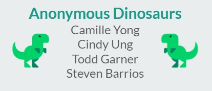

  
  <h1 align="center">The Resume Creator!</h1>

## Table of Contents
- [Description](#description)
- [Motivation](#motivation)
- [Usage](#usage)
- [Contributors](#contributors)
- [License](#license)

## Description
Create a simple and interactive resume application that everyone can use. A resume is what everyone needs. We have decided to create 4 resume templates that you can choose from. As you answer the questions that are asked, the backend will fill out that information for you. Taking the hard part of deciding the style and headache away.

## Motivation
Everyone is constantly applying for job, having a prestine resume to standout from the rest, so they can get their dream job. Using the resume creator has everything there for you, so no one will start from scratch. It allows users to save and update the resume when they login.

## Usage
Heroku 

## Contributors
<table>
  <tr>
    <td align="center"><a href="https://github.com/cindyung56"> <b>Cindy Ung</b></a> </a></td>
    <td align="center"><a href="https://github.com/camilleyong"> <b>Camille Yong</b></a> </td>
    <td align="center"><a href="https://github.com/Proper-Stevo"> <b>Steven Barrios</b></a> </td>
    <td align="center"><a href="https://github.com/toddrgarner"> <b>Todd Garner</b></a> </td>
  </tr>
</table>

## License
